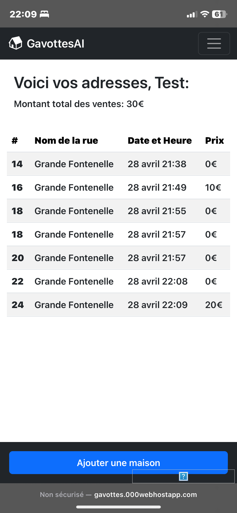
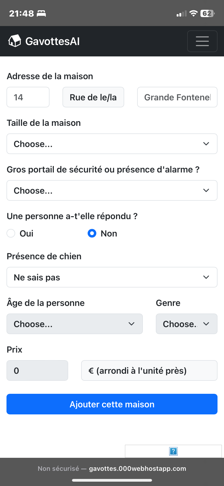

# HomePredictorAI: Enhancing Door-to-Door Sales with AI

Do you find yourself often knocking on doors to sell products, whether it's for a school project or a community initiative? I certainly do – whether it's selling Gavottes for my physics DNL class or calendars as a scout, the repetitive nature of door-to-door sales got me thinking. Is there a connection between a person's home and their likelihood to buy my products?

That's where HomePredictorAI comes in. It's my brainchild, aimed at leveraging artificial intelligence to predict whether a person is likely to purchase my products based on various arbitrarily chosen criteria.

## Project Overview:

HomePredictorAI consists of two main components:

1. **AI Development (Python):**
   The heart of the project lies in the development of an AI system using Python. While I haven't started this part yet, the plan is to train a model to predict purchase likelihood based on input parameters.

2. **Web Application (CRUD):**
   The web application, located in ./WebApp, serves as a platform for collecting data. I've already completed this aspect of the project. Currently, the site is hosted on <a href="https://www.000webhost.com/">000webhost.com</a> at <a href="https://gavottes.000webhostapp.com/">gavottes.000webhostapp.com</a>. However, I must admit, the site's security measures are not robust, and it's still a work in progress. It's built entirely with Bootstrap and managed with phpMyAdmin.

    
    

So, if you're curious about the intersection of home characteristics and purchasing behavior, or if you just want to see how AI can enhance door-to-door sales, stay tuned for updates on HomePredictorAI!
